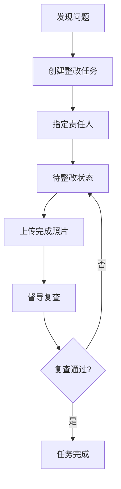

# 智慧零售陈列评估工具 PRD

## 1. 产品概述

智慧零售陈列评估工具是一款面向区域督导的纯前端巡店应用，帮助督导快速判断货架执行情况，提升门店陈列标准化水平。通过拍照标注、模板对照、自动评分和整改追踪，实现巡店流程数字化、标准化。

- **目标用户**：区域督导、门店店长、零售运营管理人员
- **核心价值**：提升巡店效率、标准化陈列评估、追踪整改进度、数据化运营决策

## 2. 核心功能

### 2.1 用户角色

| 角色 | 注册方式 | 核心权限 |
|------|----------|----------|
| 区域督导 | 系统配置 | 门店选择、拍照评估、评分查看、整改管理、记录筛选 |
| 门店店长 | 系统配置 | 查看本门店评估记录、整改任务处理 |

### 2.2 功能模块

1. **门店选择页**：门店列表、品类筛选、快速搜索
2. **货架评估页**：照片上传、缺货标注、陈列模板选择、价格牌检查、促销物料检查
3. **评分面板页**：整洁度评分、丰满度评分、动线可见性评分、重点商品占比、综合得分
4. **整改清单页**：待办列表、紧急程度分类、责任人分配、完成照片上传、复查结果
5. **巡店记录页**：日期筛选、门店筛选、品类筛选、历史记录查看

### 2.3 页面详情

| 页面名称 | 模块名称 | 功能描述 |
|----------|----------|----------|
| 门店选择页 | 门店列表 | 展示所有门店卡片，支持按区域/品类筛选 |
| 门店选择页 | 搜索功能 | 支持按门店名称、地址快速搜索 |
| 门店选择页 | 门店信息 | 显示门店名称、地址、上次巡店日期、评分趋势 |
| 货架评估页 | 照片上传 | 支持拍照或从相册选择货架照片 |
| 货架评估页 | 缺货标注 | 在照片上点击标注缺货位置，支持多个标注点 |
| 货架评估页 | 陈列模板 | 选择对应品类的标准陈列模板进行对照 |
| 货架评估页 | 价格牌检查 | 勾选价格牌是否齐全、清晰、正确 |
| 货架评估页 | 促销物料 | 勾选促销海报、跳跳卡、价格签等物料 |
| 评分面板页 | 整洁度评分 | 自动/手动评分，含评分依据说明 |
| 评分面板页 | 丰满度评分 | 根据缺货标注数量自动计算得分 |
| 评分面板页 | 动线可见性 | 评估主通道、端架、堆头的可见性 |
| 评分面板页 | 重点商品占比 | 评估重点商品陈列占比是否达标 |
| 评分面板页 | 综合得分 | 自动计算总分，雷达图展示各维度 |
| 整改清单页 | 待办列表 | 按紧急程度排序的整改任务 |
| 整改清单页 | 任务详情 | 问题描述、位置、建议整改方案 |
| 整改清单页 | 责任人分配 | 指定整改责任人及截止日期 |
| 整改清单页 | 完成验证 | 上传整改后照片，填写复查结果 |
| 巡店记录页 | 筛选条件 | 按日期范围、门店、品类筛选 |
| 巡店记录页 | 记录列表 | 展示历史巡店记录及评分概览 |
| 巡店记录页 | 记录详情 | 查看完整的巡店评估报告 |

## 3. 核心流程

### 3.1 巡店主流程

### 3.2 整改追踪流程

## 4. 用户界面设计

### 4.1 设计风格

- **主色调**：深蓝色 (#1e3a5f) - 专业、可靠
- **辅助色**：橙色 (#ff8c42) - 警示、强调
- **成功色**：绿色 (#22c55e) - 通过、达标
- **警告色**：红色 (#ef4444) - 不达标、紧急
- **背景色**：浅灰 (#f8fafc) - 清爽干净

- **按钮风格**：圆角胶囊形，带轻微阴影，悬停有缩放效果
- **卡片风格**：白色卡片，圆角12px，柔和阴影，悬停阴影加深
- **字体**：Noto Sans SC - 现代无衬线中文字体
- **图标风格**：线性图标，统一2px描边

### 4.2 页面设计概览

| 页面名称 | 模块名称 | UI元素 |
|----------|----------|--------|
| 门店选择页 | 顶部导航 | 标题、搜索框、筛选按钮 |
| 门店选择页 | 门店卡片 | 卡片网格布局，门店名称、地址、评分标签 |
| 货架评估页 | 照片区域 | 大尺寸照片展示区，支持点击标注 |
| 货架评估页 | 工具栏 | 标注工具、模板选择、检查项列表 |
| 评分面板页 | 雷达图 | 四维度雷达图，直观展示各项得分 |
| 评分面板页 | 评分卡片 | 各维度详细评分卡片 |
| 整改清单页 | 任务列表 | 按紧急度分组，卡片式列表 |
| 整改清单页 | 任务卡片 | 状态标签、问题描述、责任人、截止日期 |
| 巡店记录页 | 筛选栏 | 日期选择器、门店下拉、品类选择 |
| 巡店记录页 | 记录列表 | 时间线式布局，记录摘要信息 |

### 4.3 响应式设计

- **桌面端优先**：1280px以上宽屏展示，多列布局
- **平板适配**：768px-1279px，两列或单列布局
- **手机适配**：375px-767px，单列布局，底部导航
- **触摸优化**：按钮最小44x44px，列表项点击区域充足

### 4.4 动效设计

- **页面切换**：左右滑动过渡，模拟原生App体验
- **卡片加载**：渐入+上移动画，错落延迟
- **标注点**：脉冲动画吸引注意
- **评分变化**：数字滚动动画
- **下拉刷新**：弹性动画反馈
