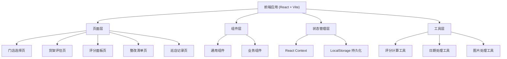
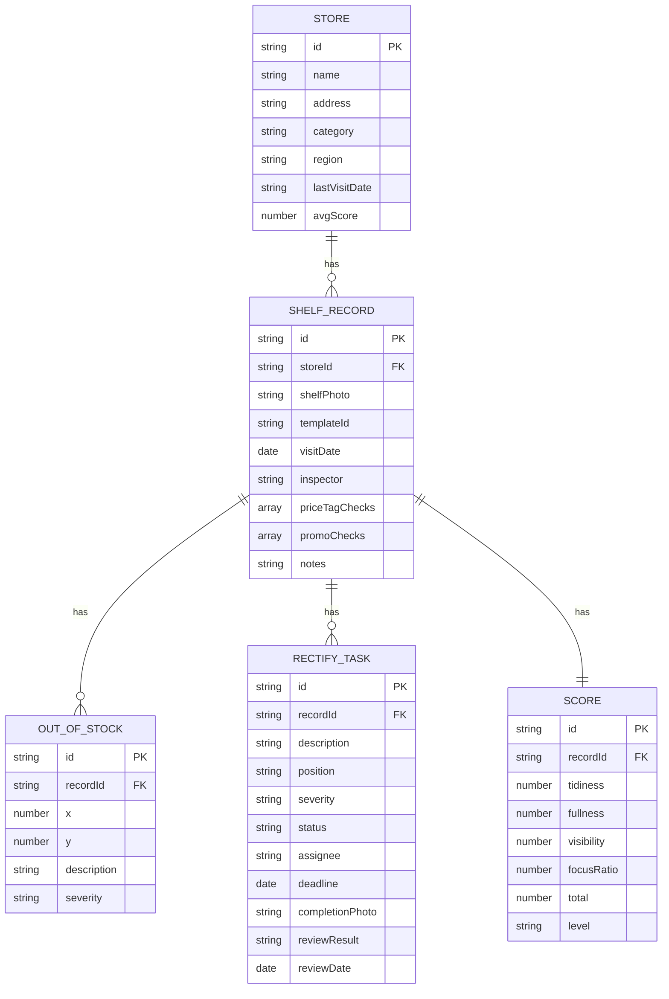

# 智慧零售陈列评估工具 技术架构文档

## 1. 架构设计



## 2. 技术描述

- **前端框架**：React@18 + TypeScript
- **构建工具**：Vite@5
- **样式方案**：TailwindCSS@3 + CSS变量
- **路由管理**：React Router@6
- **图表库**：Chart.js + react-chartjs-2 (雷达图)
- **图标库**：Lucide React
- **状态管理**：React Context + useReducer
- **数据持久化**：LocalStorage (纯前端)
- **日期处理**：date-fns

## 3. 路由定义

| 路由 | 页面 | 说明 |
|------|------|------|
| / | 门店选择页 | 首页，展示门店列表 |
| /store/:id | 货架评估页 | 具体门店的货架评估 |
| /score/:recordId | 评分面板页 | 评分详情展示 |
| /rectify/:recordId | 整改清单页 | 整改任务管理 |
| /records | 巡店记录页 | 历史记录筛选查看 |

## 4. 数据模型

### 4.1 数据结构定义



### 4.2 本地存储数据结构

```typescript
// 门店信息
interface Store {
  id: string;
  name: string;
  address: string;
  category: string; // 品类：饮料、零食、日用品等
  region: string;
  lastVisitDate: string;
  avgScore: number;
}

// 货架评估记录
interface ShelfRecord {
  id: string;
  storeId: string;
  storeName: string;
  shelfPhoto: string; // base64
  templateId: string;
  visitDate: string;
  inspector: string;
  outOfStockItems: OutOfStockItem[];
  priceTagChecks: PriceTagCheck[];
  promoChecks: PromoCheck[];
  score: Score;
  rectifyTasks: RectifyTask[];
  notes: string;
}

// 缺货标注
interface OutOfStockItem {
  id: string;
  x: number; // 百分比位置
  y: number;
  description: string;
  severity: 'high' | 'medium' | 'low';
}

// 价格牌检查
interface PriceTagCheck {
  id: string;
  name: string;
  checked: boolean;
  note?: string;
}

// 促销物料检查
interface PromoCheck {
  id: string;
  name: string;
  checked: boolean;
  note?: string;
}

// 评分
interface Score {
  tidiness: number; // 整洁度 0-100
  fullness: number; // 丰满度 0-100
  visibility: number; // 动线可见性 0-100
  focusRatio: number; // 重点商品占比 0-100
  total: number;
  level: 'excellent' | 'good' | 'pass' | 'fail';
}

// 整改任务
interface RectifyTask {
  id: string;
  description: string;
  position: string;
  severity: 'urgent' | 'high' | 'medium' | 'low';
  status: 'pending' | 'in_progress' | 'completed' | 'reviewed';
  assignee?: string;
  deadline?: string;
  completionPhoto?: string;
  reviewResult?: 'pass' | 'fail';
  reviewDate?: string;
  reviewNote?: string;
}

// 陈列模板
interface DisplayTemplate {
  id: string;
  name: string;
  category: string;
  image: string;
  description: string;
}
```

## 5. 评分算法

### 5.1 总分计算

```
总分 = 整洁度 * 0.25 + 丰满度 * 0.30 + 动线可见性 * 0.25 + 重点商品占比 * 0.20
```

### 5.2 丰满度自动计算

```
丰满度 = 100 - (缺货数量 * 扣分值)
```

- 每个高优先级缺货扣10分
- 每个中优先级缺货扣5分
- 每个低优先级缺货扣2分

### 5.3 等级划分

- 优秀：90-100分
- 良好：75-89分
- 合格：60-74分
- 不合格：0-59分

## 6. 目录结构

```
src/
├── assets/           # 静态资源
├── components/       # 公共组件
│   ├── Layout/       # 布局组件
│   ├── Card/         # 卡片组件
│   ├── Button/       # 按钮组件
│   ├── Modal/        # 弹窗组件
│   └── Chart/        # 图表组件
├── pages/            # 页面组件
│   ├── StoreSelect/  # 门店选择页
│   ├── ShelfEvaluate/# 货架评估页
│   ├── ScorePanel/   # 评分面板页
│   ├── RectifyList/  # 整改清单页
│   └── Records/      # 巡店记录页
├── context/          # React Context
├── hooks/            # 自定义Hooks
├── utils/            # 工具函数
├── types/            # TypeScript类型定义
├── data/             # Mock数据
├── App.tsx
├── main.tsx
└── index.css
```

## 7. 性能优化

- 图片压缩：使用Canvas压缩上传的照片
- 懒加载：页面组件按需加载
- 虚拟滚动：长列表使用虚拟滚动
- 防抖节流：搜索、滚动等操作优化
- 缓存策略：LocalStorage数据缓存，减少重复计算
